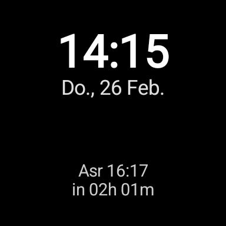
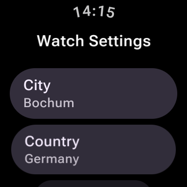

# Prayer Watch Face


Prayer Watch Face is a Wear OS app and watch face that shows the current time/date and the next islamic prayer time based on your selected city, country, and calculation settings.

## Disclaimer

This app is vibe coded (with GPT-5.3-Codex) and provided as-is. No guarantees are given for correctness, reliability, availability, or fitness for any purpose. Use it at your own risk.

## Screenshots

| Watchface | Settings | 
| --- | --- | 
|  |  

## Features

- Digital watch face with next-prayer display and countdown.
- On-watch settings screen for:
  - City
  - Country
  - Calculation method
  - Madhab (school)
  - High-latitude calendar method
- Uses online prayer time data with local caching for offline fallback.
- Ambient mode rendering support.

## Tech Stack

- Kotlin
- Wear OS Jetpack Compose (Wear Material 3)
- AndroidX Watch Face API
- Retrofit + Moshi + OkHttp
- DataStore (preferences)

## Requirements

- Android Studio (latest stable recommended)
- JDK 17
- Android SDK / Wear OS target support
- Wear OS emulator or physical watch (minSdk 30)

## Getting Started

1. Clone the repository.
2. Open the project in Android Studio.
3. Let Gradle sync and download dependencies.
4. Run the `app` module on a Wear OS emulator/device.

## Configure the Watch Face

1. Launch the app (`Prayer Watch Face`) from the watch app launcher.
2. Enter your city and country.
3. Choose calculation method, school, and calendar method.
4. Tap **Save**.
5. Apply `Prayer Watch Face` from the watch face picker.

## Data Source

Prayer times and methods are fetched from the Aladhan API:

- `https://api.aladhan.com/v1/timingsByCity/{date}`
- `https://api.aladhan.com/v1/methods`

## Run Tests

```powershell
.\gradlew test
```

## Project Structure

- `app/src/main/java/com/ercan/smartwatch/watchface` - watch face renderer and use case
- `app/src/main/java/com/ercan/smartwatch/ui/settings` - settings UI
- `app/src/main/java/com/ercan/smartwatch/data` - API, repository, models, local stores
- `app/src/test` - unit tests

## Notes

- `local.properties` is machine-specific and should not be committed.
- The repository includes a root `.gitignore` for common Android/Gradle artifacts.

## License

This project is licensed under the MIT License. See the `LICENSE` file for details.
